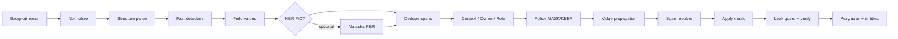

# PII Security Module

Прокси-сервис для **обнаружения, маскирования и обратного восстановления** персональных данных (ПД) в тексте перед передачей в LLM и после ответа модели. Сервис встраивается между клиентским приложением и языковой моделью: наружу уходит только обезличенный текст, а связь «маска ↔ оригинал» хранится на стороне сервиса по `payload_id`.

## Задача и идея решения

LLM не должна получать сырые ПД (ФИО, паспорт, телефон, карта и т.д.), но бизнес-логике часто нужен **обратимый** процесс: ответ модели с плейсхолдерами нужно вернуть в читаемый вид для пользователя. Решение:

1. **Первый** запрос с новым `payload_id` и исходным текстом → **mask** (обнаружение + замена в span-ах).
2. Текст с маской уходит в LLM.
3. **Повторный** запрос с тем же `payload_id` и **замаскированным** текстом → **demask** (подстановка сохранённого оригинала по span-ам).

Политики (какие типы ПД маскировать, разрешён ли demask) задаются **по системе-потребителю** (`X-System-Id` + `config.yaml`). После маскирования выполняется **fail-closed проверка** на утечки (кроме режима synthetic).

## Архитектура

```text
┌─────────────┐     POST /process      ┌──────────────────────────────────┐
│  Клиент /   │ ─────────────────────► │  FastAPI (app/main.py)           │
│  LLM-шлюз   │ ◄───────────────────── │  /health, /metrics, UI /static   │
└─────────────┘                        └──────────────┬───────────────────┘
                                                      │
                        ┌─────────────────────────────┼─────────────────────────────┐
                        ▼                             ▼                             ▼
               ┌────────────────┐            ┌─────────────────┐           ┌───────────────┐
               │ Processor      │            │ mask_text       │           │ Redis /       │
               │ mask ↔ demask  │───────────►│ (app/masking)   │           │ InMemoryStore │
               │ first-writer   │            └────────┬────────┘           │ Fernet        │
               └────────────────┘                     │                    └───────────────┘
                                                      ▼
                                            ┌─────────────────┐
                                            │ Pipeline        │
                                            │ (app/pii/       │
                                            │  pipeline.py)   │
                                            └─────────────────┘
```

| Слой | Назначение |
|------|------------|
| **HTTP** | Контракт `/process`, заголовки `X-System-Id`, `X-Mask-Mode`, метрики Prometheus, встроенный playground UI. |
| **Processor** | Определяет направление (mask/demask), таймаут маскирования, конфликты `payload_id`, запись пары (original, masked) в store. |
| **Masking** | Связка pipeline → применение замен → `verify_masked` / `final_leak_guard`. |
| **Pipeline** | Обнаружение сущностей, контекст, policy, разрешение пересечений span-ов. |
| **Store** | Персистентная (Redis) или in-memory пара текстов; оригинал шифруется **Fernet** (`PII_ENCRYPTION_KEY`). |

## Пайплайн обнаружения и маскирования

Обработка идёт по **исходной строке** с абсолютными offset-ами; длинный текст режется на **чанки** (по границам строк/предложений), чтобы не резать сущности.



### Этапы (подробнее)

1. **Structure** — разбор типовых полей анкеты («дата рождения», «паспорт серия», «email» и т.д.) для привязки значений к меткам.
2. **Fast path** — регистр детекторов (`app/pii/detectors.py`, `app/pii/detection/*`): regex, валидаторы (Luhn, ИНН, форматы телефона/паспорта), словари, эвристики имён (morphology).
3. **NER** — дополнительное извлечение ФИО (Natasha), если модель доступна; не дублирует уже найденные span-ы FIO/ADDRESS/CARDHOLDER.
4. **Context** — владелец фрагмента (клиент, организация, документ), роль даты (дата рождения vs дата выдачи), hotword-правила; повышение/подавление confidence.
5. **Policy** — финальное решение **MASK** или **KEEP** по типу, порогу профиля (`balanced` / `strict`), owner/role и списку типов системы. Детектор сам по себе не маскирует — только предлагает кандидата.
6. **Resolver** — снятие дубликатов и пересечений с учётом приоритетов типов (`app/pii/types.py`).
7. **Value propagation** — повторные вхождения уже признанного чувствительного значения в тексте.
8. **Apply** — замена span-а: форматная маска, синтетический placeholder или токен (`format` / `synthetic` / `token`).
9. **Verify** — повторный прогон детекторов по результату; при утечке — ошибка маскирования (fail-closed).

### Режимы маскирования (`X-Mask-Mode`)

| Режим | Поведение |
|-------|-----------|
| **format** | Внутри span-а все буквы и цифры заменяются на `*`; пробелы и пунктуация сохраняются (читаемый «зачёркнутый» вид без частичных хвостов). |
| **synthetic** | Подстановка правдоподобных фиктивных значений (другие ФИО, номера и т.д.); без финального leak-guard по звёздочкам. |
| **token** | Маркеры вида плейсхолдеров для строгих сценариев; для профиля `strict` может включаться автоматически. |

## Поддерживаемые типы ПД

Среди прочего: **FIO**, **CARDHOLDER**, **PHONE**, **EMAIL**, **PASSPORT**, **DRIVER**, **INN**, **SNILS**, **CARD**, **CVV**, **PIN**, **DATE** / **DATE_TEXT**, **BIRTH_PLACE**, **CITIZENSHIP**, **ISSUER**, **DEPT_CODE**, **ADDRESS**, банковские и организационные реквизиты (**ACCOUNT**, **BIK**, **KPP**, **OGRN** и др.). Полный реестр и приоритеты — в `app/pii/types.py`.

## API

### `POST /process`

**Тело:**

```json
{
  "payload": "текст",
  "payload_id": "уникальный-id-операции"
}
```

**Заголовки:**

- `X-System-Id` — ключ системы из `config.yaml` (по умолчанию `default`).
- `X-Mask-Mode` — необязательно: `format` | `synthetic` | `token`.

**Ответ:**

```json
{
  "result": "замаскированный или восстановленный текст",
  "types": ["FIO", "PHONE"],
  "entities": [{"type": "FIO", "start": 0, "end": 12}],
  "elapsed_ms": 42,
  "direction": "mask",
  "mask_mode": "format"
}
```

**Семантика:**

| `payload` относительно записи в store | `direction` |
|--------------------------------------|-------------|
| Совпадает с сохранённым **оригиналом** | `mask` → отдаётся маска (идемпотентность). |
| Совпадает с сохранённой **маской** | `demask` → отдаётся оригинал (если для системы `demask: true`). |
| Иное при существующем `payload_id` | `409` conflict. |

### Прочие эндпоинты

- `GET /health` — живость сервиса.
- `GET /metrics` — Prometheus (RPS, latency, типы масок, ошибки).
- `GET /systems` — список включённых систем и флаг demask.
- `GET /` — встроенный UI для ручной проверки mask/demask.

## Конфигурация

**`config.yaml`** — профили систем-потребителей:

```yaml
systems:
  default:
    enabled: true
    types: ["ALL"]
    demask: true
  crm:
    enabled: true
    types: ["FIO", "PHONE", "EMAIL", "PASSPORT", "CARD"]
    demask: true
```

**Переменные окружения** (см. `.env.example`):

| Переменная | Назначение |
|------------|------------|
| `REDIS_URL` | Redis для store (в Compose: `redis://redis:6379/0`). Без Redis — in-memory (один worker). |
| `PII_ENCRYPTION_KEY` | Ключ Fernet; **обязателен** для нескольких workers и переживания перезапуска. |
| `MAX_PAYLOAD_CHARS` | Лимит длины `payload` (по умолчанию 400000). |
| `MASK_TIMEOUT_SECONDS` | Таймаут этапа маскирования. |
| `PII_CHUNK_SIZE` | Размер чанка для длинных текстов. |

## Запуск

### Docker (рекомендуется)

```bash
docker compose up --build
```

Сервис: http://localhost:8000 (API + playground).

Сгенерировать ключ для production / нескольких реплик:

```bash
python -c "from cryptography.fernet import Fernet; print(Fernet.generate_key().decode())"
export PII_ENCRYPTION_KEY='...'
```

### Локально (разработка)

```bash
python3 -m venv .venv
source .venv/bin/activate
pip install -r requirements.txt -r requirements-dev.txt
export REDIS_URL=redis://localhost:6379/0   # опционально
uvicorn app.main:app --reload --port 8000
```

## Тесты

```bash
pip install -r requirements.txt -r requirements-dev.txt
pytest tests/ -q
```

| Каталог / файл | Что проверяет |
|----------------|---------------|
| `tests/test_pipeline.py` | Детекция, форматы масок, контекст, регрессии. |
| `tests/test_api.py` | HTTP-контракт, demask, заголовки, ошибки. |
| `tests/test_components.py` | Отдельные модули (store, policy, transform). |
| `tests/test_scaling.py` | Поведение при нагрузке / чанках. |

## Структура репозитория

```text
pii_service/
├── app/
│   ├── main.py              # FastAPI, /process
│   ├── masking.py           # mask_text, highlight
│   ├── store.py             # Redis / memory + шифрование
│   ├── config.py            # загрузка config.yaml
│   ├── engine/              # Processor, ошибки, policy адаптер
│   ├── pii/
│   │   ├── pipeline.py      # оркестрация detect → policy → resolve
│   │   ├── detection/       # детекторы по категориям
│   │   ├── context.py       # owner, role, hotwords
│   │   ├── policy.py        # MASK / KEEP
│   │   ├── transform.py     # format-стратегии по типу
│   │   ├── synthetic.py     # synthetic-замены
│   │   ├── verify.py        # post-check утечек
│   │   └── ...
│   └── static/              # playground UI
├── tests/
├── config.yaml
├── Dockerfile
├── docker-compose.yml
├── requirements.txt
└── requirements-dev.txt
```

## Наблюдаемость

Метрики Prometheus на `/metrics`: счётчики запросов и ошибок по системе и направлению, гистограмма latency, счётчик замаскированных типов. В коде pipeline доступны tracing-span-ы (`app/observability.py`) для профилирования этапов.

---

**Версия API:** 1.2.0 (см. `FastAPI` title в `app/main.py`).
